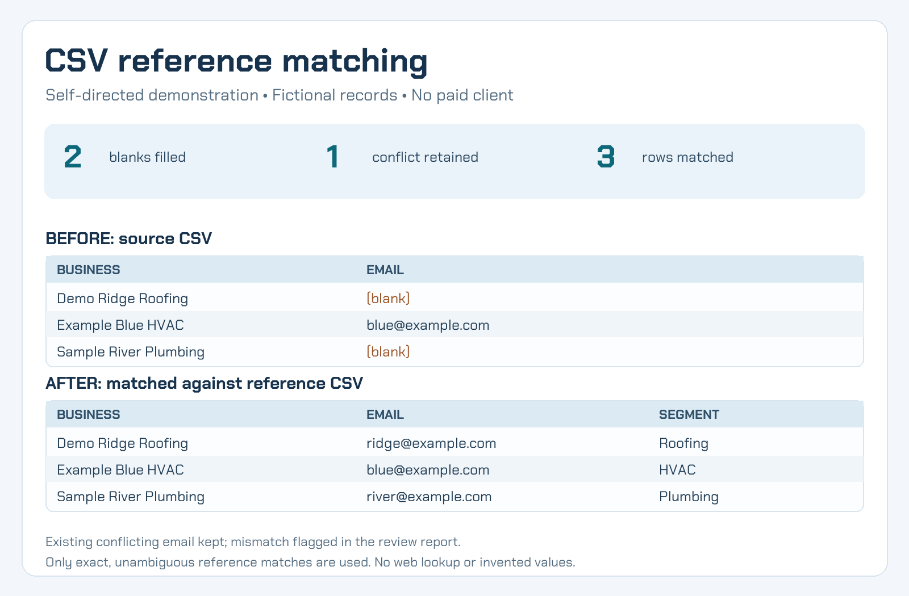

# CSV reference matching demo

Self-directed portfolio work by Sina Gharavi, built with AI assistance. The three businesses and all contact details here are fictional; there was no client or paid order. This Python standard-library tool matches a source CSV to a supplied reference CSV on chosen exact keys, fills blank fields only when the reference match is unambiguous, keeps conflicting existing values, and writes a row-level change and review report. It does not search the web or invent data.



Run the included example from this folder with Python 3.11 or newer:

```powershell
python clean_csv.py source.csv my_output.csv --reference reference.csv --key business phone --add segment
```

The command creates `my_output.csv` and `my_output_report.csv`. Compare those with `cleaned.csv` and `cleaned_report.csv`. The source and reference remain unchanged, and existing outputs are never overwritten. Choose new output names for later runs. Run `python test_clean_csv.py` for the focused checks covering matching, conflicts, malformed rows, quoted fields, Unicode, leading zeroes, phones, and formula-risk flags.

This is a small-file, human-reviewed workflow. It relies on the match keys you choose and does not verify the truth of the reference file. Ambiguous or unmatched records need your review. Do not put confidential customer data in a public repository.
